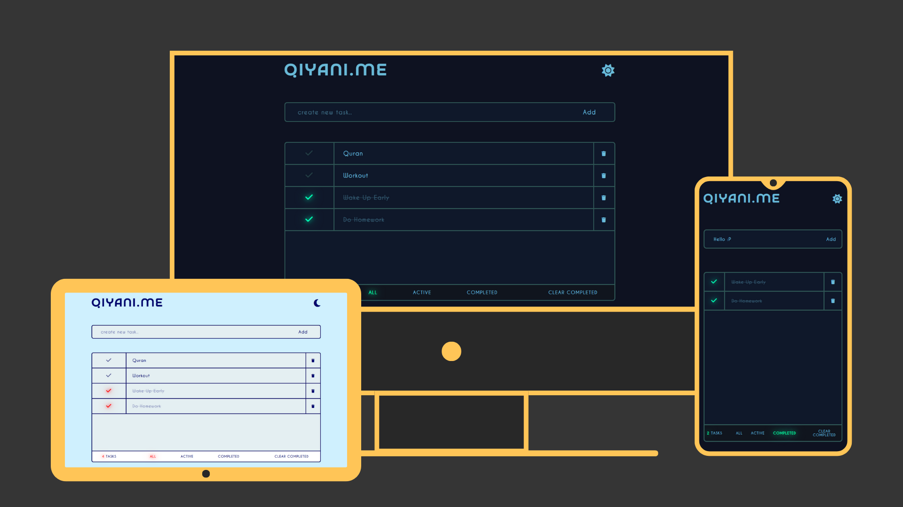

# ✅ To-Do List

A stylish and interactive to-do list app built with HTML, CSS, and JavaScript. Track your tasks with ease, switch between dark and light themes, and filter tasks based on completion status.

## 🌟 Features

- 🎨 Clean and modern design with excellent color balance  
- 🌙 Light mode / Dark mode toggle  
- 📝 Add tasks effortlessly by hitting (Enter) or clicking (Add)
- 🗑️ Clear all completed tasks with one click
- ✅ Filter by:
  - Completed tasks
  - Uncompleted tasks  


## 💻 Tech Stack

- HTML  
- CSS  
- Vanilla JavaScript  

## 🚀 Live Demo

Try it here 👇  
https://zeddy-foreal.github.io/to-do-list

## 📸 Preview



## 📁 How to Run Locally

```bash
git clone https://github.com/zeddy-foreal/to-do-list.git
cd to-do-list
# Then open index.html in your browser
